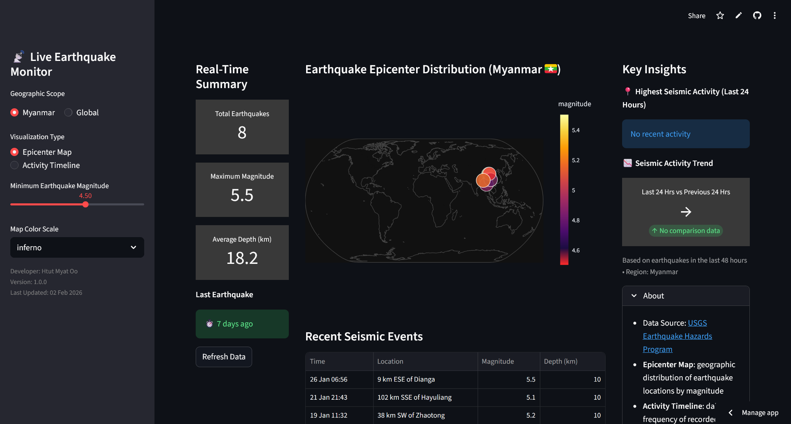
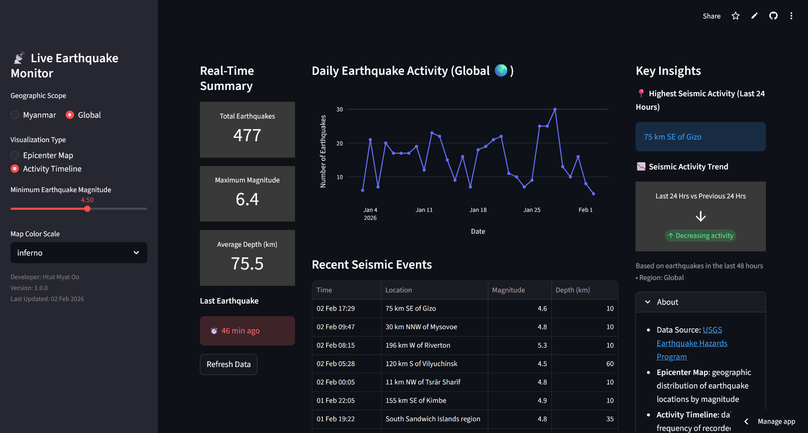

# 📡 Live Earthquake Monitor

An interactive, real-time **earthquake monitoring dashboard** built with **Streamlit** to visualize seismic activity both in **Myanmar** and globally using live data from the **USGS Earthquake Hazards Program**.

## 🖥️ Demo App

  

## 🚀 Features
- 📡 **Live Earthquake Data** (auto-updates every 10 minutes)
- 🌏 **Regional or Global View** — Focus on Myanmar or view worldwide earthquakes.
- 📊 **Dynamic Visualization Options**:
  - Epicenter Map: interactive scatter map of earthquake locations by magnitude
  - Activity Timeline: daily frequency of seismic events
- 🎚️ **User Controls**:
  - Minimum magnitude filter
  - Color theme selector for maps
  - Refresh data button for live updates
- 📈 **Real-Time Metrics**:
  - Total earthquakes
  - Maximum magnitude
  - Average depth
  - Time since last earthquake
- 📝 **Insights**:
  - Region with highest seismic activity in last 24 hours
  - Activity trend (last 24 hrs vs previous 24 hrs)
- 🌙 **Dark UI Theme** with custom CSS for a clean, modern look

## 🧠 Data Source

- [**USGS Earthquake API**](https://earthquake.usgs.gov/earthquakes/feed/v1.0/summary/all_month.geojson)
Data includes:
- Location (`place`)
- Magnitude (`mag`)
- Depth
- Latitude & Longitude
- Time (UTC)

## 🧭 References

- [**Tutorial Blog from streamlit.io**](https://discuss.streamlit.io/t/building-a-dashboard-in-python-using-streamlit/60621)
- [**Population Dashboard by dataprofessor**](https://github.com/dataprofessor/population-dashboard)
